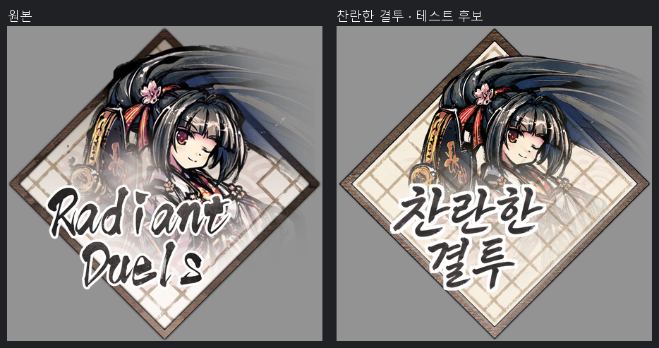

# 실제 제작 사례

원본을 어떻게 분석하고, 어떤 레이어를 생성하고, 왜 재시도했는지 실제 파일로 확인하는 사례집입니다. 모두 **2026-09-05에 제작한 후보**이며, 2026-09-07에 이 저장소로 옮겨 파일 해시와 PSD를 다시 검사했습니다.

| 사례 | 크기 | 레이어 | 생성 횟수 | 배울 수 있는 점 |
| --- | --- | --- | --- | --- |
| [공격후](furuyoni/after-attack/README.md) | 362×377 | 3 | 계획 2 + 재시도 1 | 흰색 붓과 붉은 발광 분리, 가짜 투명 배경 반려 |
| [동결](furuyoni/ice-counter/README.md) | 411×153 | 4 | 계획 2 + 재시도 1 | 숨은 RGB와 실제 보이는 색 구분, 두 색 글씨와 효과 |
| [찬란한 결투](furuyoni/radiant-duels/README.md) | 745×743 | 7 + 캐릭터 마스크 | 계획 5 + 재시도 2 | 캐릭터·프레임·바탕 분리, 생성물 수정, 페이드 마스크 |

## 사례 안에서 볼 수 있는 것

원본에셋, 레이어에셋, 통합에셋, 실제 PSD, 색상·알파 분석, 정확한 생성 프롬프트, 실패작을 포함한 생성 원본, 선택/재시도 관계, 당시 QA와 이번 보관 검증 기록을 포함합니다. 모든 원본·이미지·PSD는 재인코딩 없이 복사했고 해시로 대조했습니다. 세 사례의 생성 출력 13장을 모두 포함했습니다.

이 묶음은 기존 제작 기록에서 핵심 자료를 선별한 사례집입니다. 중복된 작업 revision, 실패한 중간 PSD, 호스트 전용 실행 스크립트와 전체 게임 자료는 포함하지 않습니다. 프롬프트 텍스트는 유지하고, 생성 도구의 임시 출력 경로와 개인 PC의 절대 경로는 제거했습니다. 일부 참조·재시도 관계는 당시 기록을 바탕으로 정리했으며 그 근거를 JSON에 구분해 적었습니다.

## 결과를 읽는 기준

PSD 파일 구조와 합성 검사는 세 사례 모두 통과했습니다. 당시 원본 대비 비텍스트 영역 일치율은 각각 31.7%, 7.1%, 6.3%로 해당 작업의 95% 기준에 미달했습니다. 이 값은 고정 영역의 RGBA 오차를 측정한 수치이며 종합 품질 점수나 사례 간 순위가 아닙니다. 각 사례의 영역·임계값·게이트 실행 범위는 해당 QA 기록을 보세요.

시각적으로 읽히는 한글 후보를 만드는 과정, 원본과의 차이, 엄격한 검수에서 미달한 이유를 함께 보관합니다. **세 사례를 게임에 새로 적용하거나 승인한 것은 아닙니다.** 당시 관찰과 이번 파일 검증은 날짜를 구분했습니다.

기존 제작 스크립트로 만든 사례이므로 현재 v0.1 CLI의 입력 스키마와 다릅니다. 특히 찬란한 결투 PSD의 별도 마스크는 기존 수작업 파이프라인 기능입니다. v0.1 CLI가 해당 마스크를 자동 생성한다고 해석하면 안 됩니다.

사례 이미지·PSD·생성물에는 코드의 MIT 라이선스가 적용되지 않습니다. [에셋 권리 안내](ASSET-RIGHTS.md)를 함께 확인하세요.
