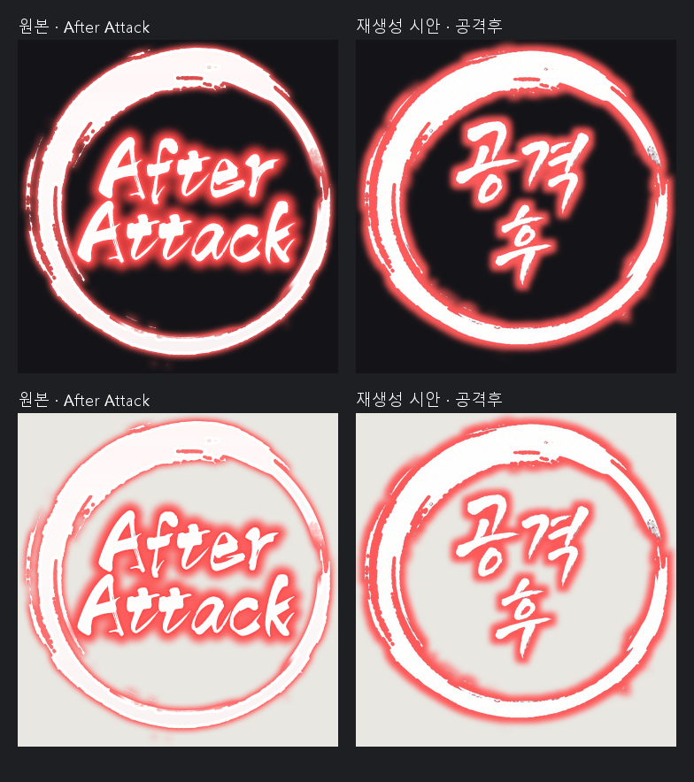
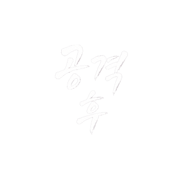
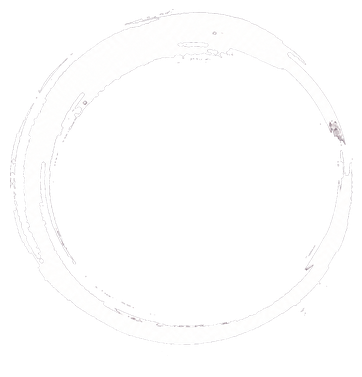
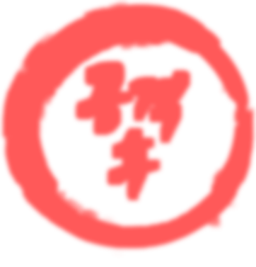

# 공격후 — 흰색 붓과 붉은 발광

`After Attack`을 기존 프로젝트 용어인 `공격후`로 제작한 362×377 시험 후보입니다. 글씨는 `공격 / 후` 두 줄로 배치했습니다.

## 분석과 판단

원본의 붉은 RGB를 배경색으로 간주하지 않고 알파를 확인했습니다. 원 안쪽은 투명하며, 흰색 붓/글씨 주변의 붉은 발광을 별도 효과로 해석했습니다. 실측 흰색 코어는 RGB 255·252·252, 붉은 발광 대표색은 255·79·79였습니다. 최종 효과 베이크에는 255·89·89를 사용했으며 측정값과 적용값을 구분했습니다.

생성 전에 크기·알파·팔레트·번역을 확인했고, 밝고 어두운 바탕 비교와 통합 분석 문서는 제작 중 보완했습니다. 모든 분석 항목이 첫 생성 전에 이미 문서화되어 있었다고 주장하지 않습니다. [분석 기록](작업기록/analysis.json)

## 생성 3회, 레이어 3개

| 호출 | 내용 | 판단 |
| --- | --- | --- |
| 1 | 투명 배경의 흰색 원형 붓 | RGB에 체크무늬가 그려져 반려 |
| 2 | 마젠타 배경의 원형 붓 재생성 | 키잉 후 후보 아트로 사용 |
| 3 | 한글 글씨 생성 | 키잉 후 배치 |

계획 2회에 원형 아트 재시도 1회가 추가됐습니다. 발광은 생성된 링과 글씨의 알파를 바탕으로 로컬에서 만들었습니다. 두 번째 합성 revision은 기존 생성물을 재사용했으며 추가 생성은 0회였습니다. [정확한 프롬프트와 생성 원본](작업기록/generation-prompts.json)

PSD 패널 위→아래: 한글 글씨 → 흰색 링 → 붉은 발광. 생성된 래스터 글씨이며 폰트 텍스트는 아닙니다.

| 한글 글씨 | 원형 아트 | 발광 |
| --- | --- | --- |
|  |  |  |

## 확인한 것과 남은 차이

2026-09-07에 PSD를 다시 열어 크기, 레이어 3개의 이름과 순서, 합성 결과를 확인했습니다. 이번 밝고 어두운 바탕 비교에서 PNG/PSD 최대 채널 차이는 2/255 이내였습니다. [이번 검증](작업기록/casebook-verification.json)

링의 붓자국, 글자 폭, 발광 형태는 원본과 다릅니다. 당시 비텍스트 영역 채널차 10 이하 일치율은 31.7%였고 95% 기준을 통과하지 못했습니다. [당시 QA](작업기록/qa.json)

## 파일

- [원본 PNG](원본에셋/攻击后_EN_원본.png) · [한글 후보 PNG](통합에셋/攻击后_EN_KO.png)
- [레이어 PSD](攻击后_EN_KO.psd) · [배치·효과 spec](작업기록/spec.json)
- [생성 원본 3장](작업기록/생성원본/) · [복사 파일 해시](작업기록/copied-files.json)

게임 미적용 후보입니다. Photoshop GUI 확인은 수행하지 않았습니다. [사례 에셋 권리 안내](../../ASSET-RIGHTS.md)
