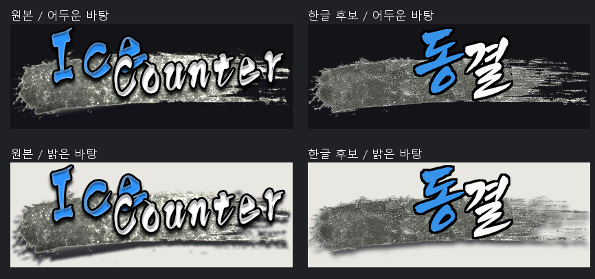
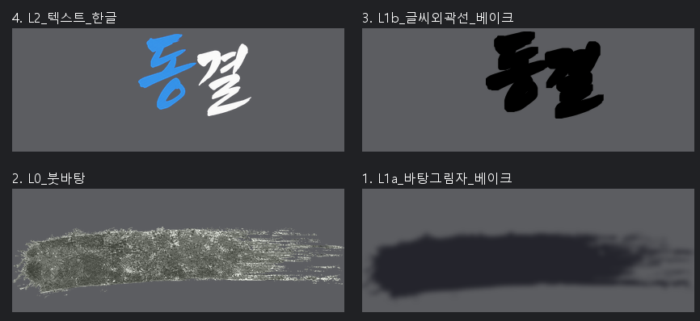

# 동결 — 숨은 RGB를 그림으로 착각하지 않기

`Ice Counter`를 기존 프로젝트의 에셋 용어인 `동결`로 제작한 411×153 시험 후보입니다. 파란색은 `동`, 흰색은 `결`에 적용했습니다.

## 분석이 결과를 바꾼 부분

원본을 일부 뷰어로 보면 상단에 금색 무늬가 보입니다. 알파와 밝고 어두운 바탕을 대조하니 대부분 거의 투명한 픽셀의 숨은 RGB였습니다. 별도 금색 장식 레이어를 만드는 계획을 취소하고 실제로 보이는 회색·올리브색 붓 바탕을 대상으로 삼았습니다.

| 영역 | 대표색 RGB | 역할 |
| --- | --- | --- |
| 파란 글씨 | 54·147·233 | `동`의 잉크 |
| 흰 글씨 | 250·250·249 | `결`의 잉크 |
| 붓 바탕 몸체 | 107·110·102 | 긁힌 질감의 회색·올리브색 |
| 낮은 명도의 하단 | 17·17·26 | 바탕 그림자 |

전체 평균색으로 처리하지 않고 샘플 영역과 알파를 구분했습니다. 첫 생성 전에 저장한 분석을 바탕으로 작업했습니다. [분석 기록](작업기록/analysis.json) · [당시 원본 분석 이미지](작업기록/원본_밝기별_분석.png)

## 생성 3회, 레이어 4개

첫 붓 바탕은 실제 알파 없이 체크무늬가 나온 RGB여서 반려했습니다. 이후 마젠타 붓 바탕 1회, 파랑/흰색 한글 글씨 1회를 생성했습니다. 계획 2회 + 재시도 1회이며, 외곽선과 그림자는 생성된 레이어를 바탕으로 베이크했습니다. [프롬프트·실패작·선택 기록](작업기록/generation-prompts.json)

PSD 패널 위→아래: 한글 글씨 → 검은 글씨 외곽선 → 붓 바탕 → 바탕 그림자. 원본 픽셀 컷아웃·지우기·알파 복사는 당시 수행하지 않았습니다.

## 확인한 것과 남은 차이

2026-09-07 재검증에서 PSD 크기, 레이어 4개의 순서와 합성 결과를 확인했습니다. PNG/PSD 최대 채널 차이는 2/255 이내였습니다. [이번 검증](작업기록/casebook-verification.json)

붓 바탕의 윤곽·질감과 글씨 면적은 원본과 차이가 남습니다. 당시 비텍스트 영역의 RGBA 채널차 10 이하 일치율은 7.1%로 95% 기준에 미달했습니다. 전체 레거시 게이트는 L4 텍스트 이름 가정 때문에 실행하지 않았고, 별도 선별 측정 결과만 남겼습니다. [당시 QA](작업기록/qa.json)

## 파일

- [원본 PNG](원본에셋/冻花结晶_EN_원본.png) · [동결 후보 PNG](통합에셋/冻花结晶_EN_KO.png)
- [4-layer PSD](冻花结晶_EN_KO.psd) · [레이어 PNG](레이어에셋/) · [배치·효과 spec](작업기록/spec.json)
- [생성 원본 3장](작업기록/생성원본/) · [복사 파일 해시](작업기록/copied-files.json)

게임 미적용 후보이며 실제 런타임 표시 크기는 확인하지 않았습니다. Photoshop GUI 확인은 수행하지 않았습니다. [사례 에셋 권리 안내](../../ASSET-RIGHTS.md)
