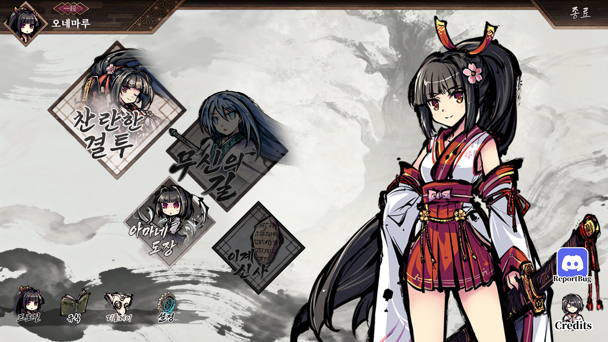

# 성공 사례 — 메인 메뉴 한글 적용

사용자가 이 프로젝트 대화에서 "원본이랑 한글패치 적용한거야"라고 제공한 두 게임 화면입니다. 적용 후 화면에서 메뉴의 한국어 표시와 배치를 확인할 수 있습니다.

## 한글패치 적용 후

## 적용 전

## 화면에서 확인한 결과

| 위치 | 한글 표시 |
| --- | --- |
| 큰 메뉴, 좌측 | 찬란한 결투 |
| 큰 메뉴, 중앙 | 무신의 길 |
| 작은 메뉴, 좌측 | 아마네 도장 |
| 작은 메뉴, 우측 | 이계 신사 |
| 하단 메뉴 | 프로필 · 규칙 · 리플레이 · 설정 |
| 우측 상단 | 종료 |

게임의 삽화와 메뉴 구도를 유지한 화면에서 9개 메뉴 항목이 한국어로 읽힙니다. 이 사례의 성공 기준은 **사용자가 제공한 실제 적용 화면에서 한국어 메뉴가 표시되는 것**입니다. 파일 미리보기뿐 아니라 게임 화면에서 결과를 보여줍니다.

좌측 상단 아바타는 두 화면에서 다릅니다. 비교 대상은 메뉴의 한국어 표시이며 아바타 차이를 패치의 결과로 해석하지 않습니다. 단수 표기 `一段`과 `ReportBug`, `Credits`는 이 성공 범위에 포함하지 않습니다.

## 보관과 근거

- [적용 전 원본 캡처](before.png), [적용 후 원본 캡처](after.png)를 리사이즈·리터치 없이 복사했습니다.
- [evidence.json](evidence.json)에 화면 크기, SHA-256, 사용자가 제공한 설명, 관찰한 항목을 기록했습니다.
- 2026-09-07에 화면과 복사 파일을 확인했습니다. 정확한 원래 캡처 날짜는 별도로 확정하지 않았습니다.

이 화면은 기존 한글패치의 결과입니다. 2026-09-05의 [찬란한 결투 재생성 실험](../radiant-duels/README.md)과 동일한 에셋이라고 연결하지 않습니다. 화면에 대응하는 레이어·PSD·생성 횟수의 확정 기록이 없으므로 다른 실험의 파일을 가져와 이 성공 사례의 제작 원본으로 제시하지 않습니다.

이번 보관 작업에서 게임을 재실행하거나 모든 hover/disabled 상태를 다시 시험하지는 않았습니다. [사례 에셋 권리 안내](../../ASSET-RIGHTS.md)
