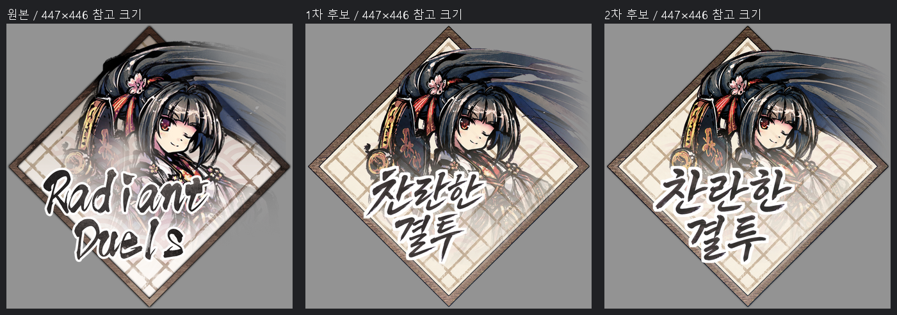
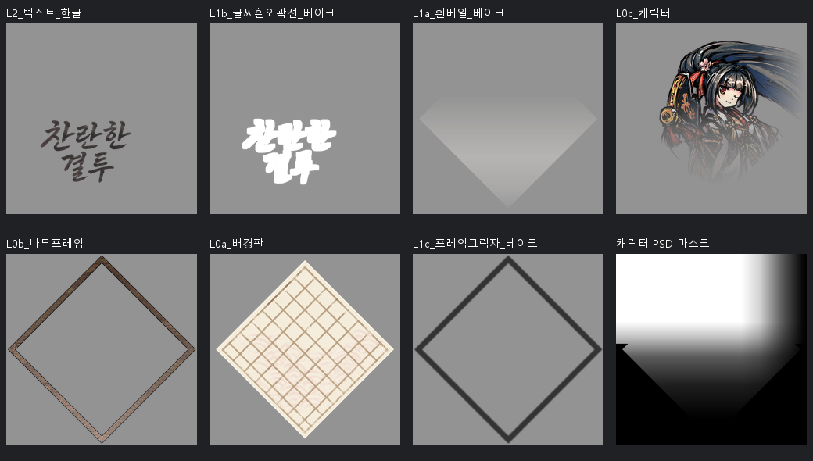

# 찬란한 결투 — 캐릭터·프레임·글씨를 나누어 조립하기

`Radiant Duels`를 `찬란한 결투`로 제작한 745×743 메뉴 시험 후보입니다. 원본의 글씨 뒤에 가려진 의상과 종이 무늬를 새로 추론하고, 캐릭터·프레임·바탕·효과·글씨를 분리했습니다.

## 먼저 분석한 것

마름모 나무 프레임, 크림색 격자 종이, 프레임 밖으로 뻗는 머리카락, 하단의 흰 베일, 먹색 글씨와 흰 외곽선을 구분했습니다. 머리카락과 하단 의상의 페이드는 별도 마스크로 남기기로 했습니다.

| 영역 | 실측 중앙값 RGB |
| --- | --- |
| 글씨 잉크 | 61·56·55 |
| 흰 외곽선 | 255·255·255 |
| 나무 프레임 | 149·123·108 |
| 종이의 밝은 영역 | 251·247·243 |
| 머리카락 | 31·33·43 |

이 값은 각 샘플 영역의 관찰값입니다. 생성 프롬프트와 후처리에서는 역할에 맞게 별도 목표색·범위를 사용했습니다. 계층은 PNG를 보고 추론한 것이며 원래 PSD를 복원한 것이 아닙니다. [생성 전 분석과 좌표](작업기록/analysis.json)

## 왜 7회 생성했나

| 호출 | 생성 대상 | 사용과 수정 이유 |
| --- | --- | --- |
| 1 | 글씨 없는 기준 그림 | 체크무늬가 포함되어 참조로만 사용, 최종 픽셀 미사용 |
| 2 | 나무 프레임 | 최종 프레임의 기반 |
| 3 | 크림색 격자 바탕 | 최종 배경판의 기반 |
| 4 | 캐릭터 | 머리카락 사이 큰 틈과 윤곽 차이가 있어 재시도 |
| 5 | 한글 글씨 | 지나치게 각지고 세로로 긴 형태여서 재시도 |
| 6 | 캐릭터 수정 생성 | 4번을 대체 |
| 7 | 글씨 수정 생성 | 5번을 대체 |

기본 계획 5회에 재시도 2회가 더해졌습니다. 최종 레이어 화소에는 2·3·6·7번 생성물을 사용했습니다. 효과 레이어는 이 생성물의 알파와 측정한 파라미터에서 만들었습니다. [모든 프롬프트와 참조 관계](작업기록/generation-prompts.json)

## 7개 레이어와 캐릭터 마스크

PSD 패널 위→아래 순서입니다.

1. 한글 글씨
2. 글씨 흰 외곽선
3. 흰 베일
4. 캐릭터 + 페이드 마스크
5. 나무 프레임
6. 배경판
7. 프레임 그림자

레이어 PNG의 캐릭터에는 페이드가 반영되어 있습니다. PSD에는 페이드 전 캐릭터와 조절 가능한 회색조 마스크를 따로 넣었습니다. [페이드 전 캐릭터와 마스크](레이어에셋/마스크와원본/)도 포함합니다. 글씨 자체는 생성된 래스터이며 폰트 텍스트는 아닙니다.

이 PSD는 기존 제작 파이프라인에서 만든 파일입니다. 현재 저장소의 v0.1 CLI가 별도 마스크를 자동 생성하는 예제는 아닙니다.

## 확인한 것과 남은 차이

2026-09-07에 PSD를 재열어 7개 레이어 이름·순서·크기, 캐릭터 마스크와 보관된 마스크의 일치, 합성 PNG와의 차이를 검사했습니다. 최대 채널 차이는 어두운 바탕 3/255, 밝은 바탕 2/255였습니다. [이번 검증](작업기록/casebook-verification.json)

원본과 얼굴 비율·의상 세부·머리카락 윤곽·격자 간격이 다릅니다. 당시 비텍스트 영역 RGBA 채널차 10 이하 일치율은 6.3%로 95% 기준에 미달했고, 알파 실루엣 IoU는 약 0.945였습니다. 레거시 전체 게이트는 도구 오류로 차단됐으며 통과로 처리하지 않았습니다. [당시 QA](작업기록/qa.json)

미리보기의 447×446 크기는 기존 표시 메타데이터를 참고한 값이며 실제 게임을 실행해 검증한 크기는 아닙니다.

## 파일

- [원본 PNG](원본에셋/绚烂竞演_EN_원본.png) · [찬란한 결투 후보 PNG](통합에셋/绚烂竞演_EN_KO.png)
- [7-layer PSD와 마스크](绚烂竞演_EN_KO.psd) · [레이어 PNG](레이어에셋/)
- [생성 원본 7장](작업기록/생성원본/) · [배치·효과 spec](작업기록/spec.json)
- [밝고 어두운 원본 대조](통합에셋/원본_한글_대조.png) · [복사 파일 해시](작업기록/copied-files.json)

게임 미적용 후보입니다. Photoshop GUI 확인은 수행하지 않았습니다. [사례 에셋 권리 안내](../../ASSET-RIGHTS.md)
