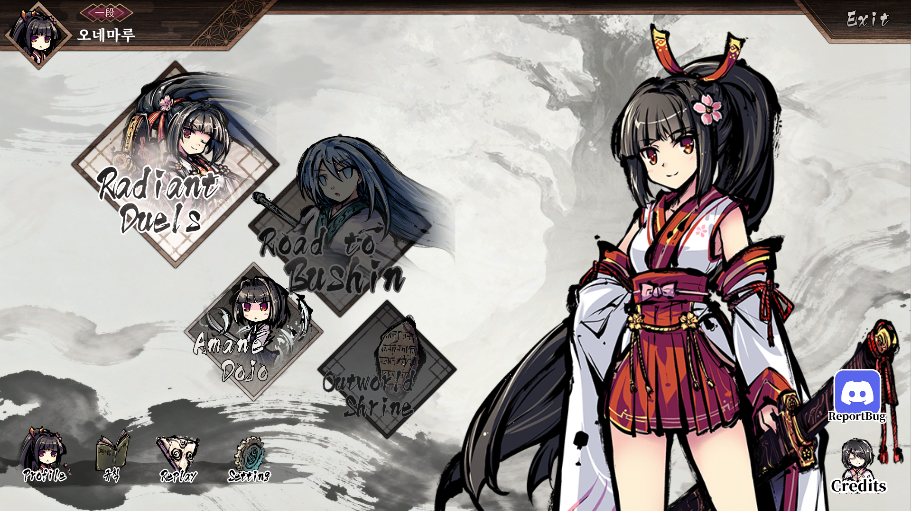

# 성공 사례 — Rule을 규칙으로 바꾸고 게임에서 확인

2026-08-23, 메인 메뉴의 `Rule` 한 항목을 `규칙`으로 교체하고 실제 게임 창에서 확인한 기록입니다. 화면 하단에서 나머지 `Profile`, `Replay`, `Setting`은 영어로 남아 있고 해당 항목만 `규칙`으로 표시됩니다.

## 확인된 성공

| 확인 항목 | 당시 결과 |
| --- | --- |
| 한국어 스프라이트 제작·다시 추출 | 완료, 198×232 |
| 적용 상태 기록 | applied |
| 게임 화면 | Rule 위치에 규칙 표시 |
| 카탈로그 JSON 파싱 오류 | 최종 QA 기록에서 없음 |
| CRC/AssetBundle 로드 오류 | 최종 QA 기록에서 없음 |

기존 missing-script와 underline 글리프 경고는 별도로 남아 있었습니다. 이 성공 사례는 그 경고를 모두 해결했다는 주장이 아니라, **규칙 메뉴 에셋을 적용하고 정상 표시를 확인한 작업**입니다.

## 적용 에셋

텍스처는 198×237, 추출한 스프라이트는 198×232입니다. 보관된 PNG의 SHA-256이 당시 빌드 기록의 스프라이트 해시와 일치하는 것을 2026-09-07에 확인했습니다. 레이어 PSD와 생성 호출 수는 이 사례의 확인 자료에 없으므로 만들어 넣지 않았습니다.

## 남긴 근거

[evidence.json](evidence.json)에 당시 QA·적용 기록의 필요한 항목, 원래 기록의 해시, 캡처와 에셋의 해시를 담았습니다. 개인 PC의 설치 경로는 제외했습니다. 게임 실행 파일·번들·전체 카탈로그는 포함하지 않았습니다.

당시 실행 결과를 보관한 사례이며 이번에 현재 설치본을 새로 실행해 재검증한 것은 아닙니다. 현재 v0.1 CLI로 생성한 예제도 아닙니다. 이후 더 넓은 범위의 결과는 [메인 메뉴 적용 화면](../main-menu-applied/README.md)에서 볼 수 있습니다.

[사례 에셋 권리 안내](../../ASSET-RIGHTS.md)
