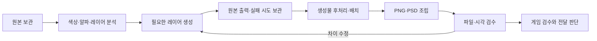

# 제작 과정과 책임

## 한 에셋을 만드는 흐름

| 담당 | 판단·실행 | 근거 |
| --- | --- | --- |
| 작업자/에이전트 | 번역 근거, 원본 분석, 생성 계획 | analysis.json, 밝고 어두운 미리보기 |
| 생성 도구 | 그림·글씨 레이어 생성 | 정확한 prompt, references, raw, retry_of |
| 작업자/후처리 코드 | 생성물 배치·색·효과 | spec의 processing, 재현 가능한 처리 코드 |
| 로컬 CLI | 아카이브, PNG/PSD 조립, 해시·합성 검사 | spec, qa, manifest |
| 리뷰어 | 실제 표시 크기와 원본 비교 | 새 visual-review-001.json 또는 Markdown |
| 게임 담당자 | 런타임·입력 상태·번들 검수 | 실제 실행 화면·로그 |
| 프로젝트 운영자 | 개발사 조건·전달 방식·배포 결정 | 프로젝트별 별도 합의 기록 |

이 역할표는 실행 중인 봇 목록이 아닙니다. 현재 저장소는 에이전트 스킬과 로컬 CLI를 제공합니다. 이메일·모금·디스코드·개발사 연락·배포는 자동화하지 않습니다.

## 분석 기록

`init`이 측정하는 것은 크기, 알파 비율, 알파 bbox, 거의 불투명한 픽셀의 빈도색입니다. 의미별 레이어와 글씨 영역은 사람이 관찰합니다. 분해된 원본 레이어가 없는 상황에서 확신할 수 없는 부분은 `confidence`와 `unresolved_observations`에 적습니다.

색을 기록할 때는 RGB/hex, 색 범위, 샘플 bbox, 코어/가장자리/광택을 구분합니다. 원본의 알파 0 픽셀 RGB는 배경색 근거로 쓰지 않습니다. 추정된 그림자 반경·외곽선 두께·페이드 방향·불투명도도 남깁니다. 생성 모델이 레이아웃을 완전히 일치시킨다고 가정하지 않습니다.

## 생성 이력

한 생성 호출마다 한 `id`를 사용합니다. 출력이 잘못되어도 파일을 보존하고 `outcome: rejected`를 기록합니다. 재시도는 새 ID와 `retry_of`로 연결합니다. `archive`는 실제 생성기가 아닌 보관기입니다. 도구 실행 전에 분석을 끝내고, 도구 응답 후 즉시 보관하세요.

선택 여부를 바꾸려면 기존 기록을 덮어쓰지 말고 판단 변경을 새 리뷰 기록에 남깁니다. 현재 CLI에서 rejected를 다시 선택하는 승격 기능은 없습니다. 원본 파일이 유일한 참조가 아니었다면 모든 실제 참조를 기록합니다. 참조와 raw는 바이트 그대로 복사합니다. 기록에는 호스트의 절대 경로 대신 작업 폴더 안 상대 경로와 SHA-256을 사용합니다.

여러 생성물이 한 API 호출에서 반환되는 백엔드는 v0.1의 단일 출력 기록 계약에 직접 맞지 않습니다. 해당 호출의 모든 원본을 별도 보관하고 호출 수를 수동 검증하세요. 자동 집계가 필요하면 call ID와 output ID를 분리하는 어댑터를 먼저 구현해야 합니다.

## 후처리와 층 순서

생성 raw 파일은 유지하고 별도 파일에 후처리합니다. 작업 코드 역시 작업 폴더에 보관합니다. 같은 원본 크기의 풀캔버스 레이어를 CLI에 넘깁니다. 역할 이름 `L0/L1/L2`와 쌓임 순서는 별개입니다. 그림자→배경판→그림→광택→외곽선→글씨 같은 실제 순서를 배열로 적습니다.

색 보정, resize, 위치, 마스크, 글로우의 입력 생성 ID·좌표·색·반경·불투명도를 processing에 남깁니다. 재현 코드 파일은 spec의 `processing_files` 배열에 JSON 기준 상대 경로로 넣습니다. build가 해당 파일을 recipes 폴더로 복사하고 해시를 기록하며 실행하지는 않습니다. 효과가 생성 레이어 여러 개에서 파생되면 해당 생성 ID를 모두 기록합니다.

## 출력·검증 상태

`build`는 원본/생성 evidence를 검사하고, 레이어를 revision별 폴더로 복사하며 PNG와 PSD를 저장합니다. PSD를 재열어 이름·순서·bbox·opacity·visibility·normal blend를 확인하고 개별 레이어 픽셀/알파 및 밝은/어두운 바탕의 합성 오차를 검사합니다. PNG에는 보이는 레이어만, PSD에는 숨겨진 레이어도 유지합니다.

PSD 비교 허용치는 8-bit 채널 최대 3, 배경 합성 평균 0.5입니다. 이는 렌더러 간 반올림 오차를 위한 기준이며 원본과 후보의 시각 유사도 기준이 아닙니다. 실제 Photoshop GUI 호환성은 따로 확인해야 합니다.

`manifest.json`에는 그 revision에서 보관한 원본·레이어·PSD·비교 이미지·분석·생성 기록·스펙·QA의 파일 크기와 SHA-256을 담습니다. manifest 자신은 제외합니다. 새 시도나 revision은 예전 manifest에 소급 추가하지 않습니다. 루트의 진행 중 analysis.json 대신 각 build의 고정 snapshot을 검증합니다. 변경 탐지용이며 서명·접근통제·악의적 변조 방지는 아닙니다.

| 상태 | 의미 |
| --- | --- |
| structural_status: PASS | 파일/PSD 검사 통과 |
| visual_review: PENDING | 번역·원본 충실도·가독성 검수 필요 |
| fidelity_review: PENDING | 원본과의 차이 판단/필요한 정량 검사 미완료 |
| in_game_qa: NOT_RUN | 실제 게임에서는 확인하지 않음 |
| release_approved: false | 배포 승인 아님 |

`verify`는 무결성과 PSD 검사를 재실행합니다. QA 결과를 덮어쓰지 않습니다. 사람이 실행한 시각 검수는 새 파일로 기록하고 파일 해시·검토 크기·원본 대비 차이·검수자를 함께 적습니다. 스크린샷 비교를 실제 게임 실행 확인으로 바꾸어 적지 않습니다.

## 공개 코드와 제작 자료

코드와 제작 사례를 구분합니다. 고객/게임마다 `jobs/`를 분리하고 해당 자료의 보관·공유 권한을 관리합니다. 기본 gitignore는 이미지·PSD·번들·ZIP을 제외합니다. 사용자가 요청한 비공개 저장소의 성공 적용 사례 2건과 제작 실험 3종만 `case-studies/furuyoni/` 경로에서 예외로 추적하며, 해당 폴더의 ASSET-RIGHTS 안내를 따릅니다. 사례 원본·생성물·PSD에는 코드의 MIT 라이선스가 적용되지 않습니다.
